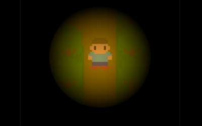

# LostintheWoods
Making a game for js13kgames.com

## Story
Nah, not gonna tell what the game is about. See for yourself.
Download the zip and unpack it or go to: <link to js13kgames>
(find your cabin!)

## Controls
When you open the game for the first time it is a small screen, just refresh and hope it becomes bigger. (you can still play on the little window btw).
Space = start
Arrow keys is movement: RIGHT/UP/LEFT/RIGHT

## Reflection
My goal was to get back in the game (#puns) with javascript. I also wanted to learn to work via canvas element, which I did.

I still have a lot of room left, like 6kB. But no time. So this is it.I think I spend like 40 hours making this.

## Resources
I used this tutorial as a basis for the movement and map: [https://www.youtube.com/channel/UCHpHBzk4fz3oeQ31hmCreGg](https://www.youtube.com/channel/UCHpHBzk4fz3oeQ31hmCreGg)

I created the graphics myself in Inkscape. Pretty fun doing pixel art in Inkscape and I learned that drawing as little shapes as possible makes your filesize shrink a lot. I created my character in inkscape en than generated it with arrays and code on canvas. Other graphics: just svg (less work).
